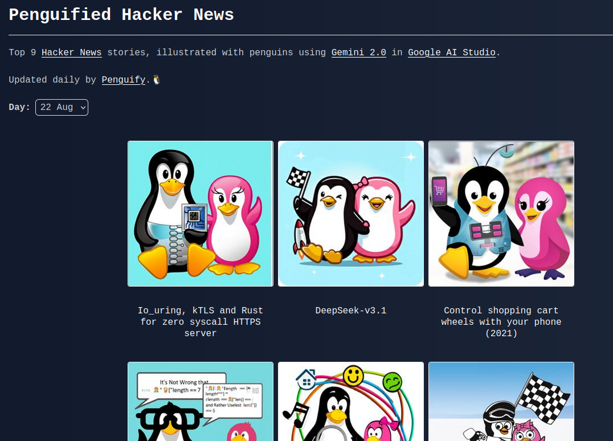

# penguify

**Illustrate Hacker News with penguins** 🐧

🚧 This is a work in progress. 🚧

Penguified Hacker News can be found [here](https://benkulcsar.github.io/penguify.html).

Penguify currently performs the following steps in a GitHub Actions workflow once a day:
1. Fetch [top Hacker News stories](https://news.ycombinator.com/news)
2. Generate penguin-style illustrations using [Gemini 2.0](https://developers.googleblog.com/en/generate-images-gemini-2-0-flash-preview/)
3. Upload them to S3 for serving via CloudFront.
